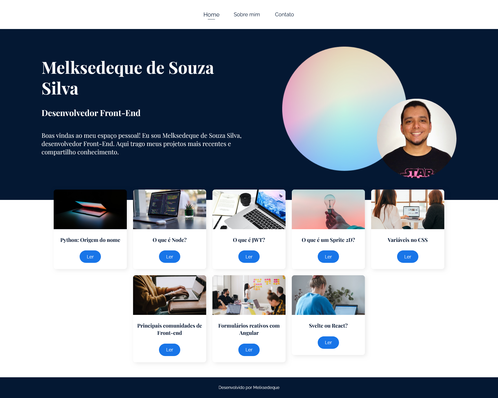

# SPA em React - Sobre mim



## Menu

- [Layout](#layout)
- [Descrição](#descrição)
  - [Principais recursos incluem](#principais-recursos-incluem)
- [Tecnologias Utilizadas](#tecnologias-utilizadas)
- [Estrutura de Pastas](#estrutura-de-pastas)
  - [Arquivos Principais](#arquivos-principais)
- [Como Instalar e Rodar o Projeto](#como-instalar-e-rodar-o-projeto)
  - [Configuração](#configuração)
  - [Casos de Uso Comuns](#casos-de-uso-comuns)
  - [Solução de Problemas](#solução-de-problemas)
- [Projeto ao vivo](#projeto-ao-vivo)
- [Licença](#licença)
- [Autor](#autor)

## Layout

[Link do Figma](https://shorturl.at/mXwBG)

## Descrição

Este projeto é uma Single Page Application (SPA) em React que serve como um site pessoal e blog. O site inclui informações sobre o autor, uma seção de blog com posts, e uma página de contato.

### Principais recursos incluem

- Página inicial com lista de posts do blog
- Página "Sobre Mim" com informações pessoais
- Página de contato com links para redes sociais
- Sistema de roteamento para navegação entre páginas
- Componentes reutilizáveis para posts e layout

## Tecnologias Utilizadas

- React
- React Router DOM
- React Icons
- React Markdown
- CSS Modules

## Estrutura de Pastas

```
.
├── public/
├── src/
│   ├── assets/
│   ├── componentes/
│   ├── json/
│   ├── paginas/
│   ├── App.css
│   ├── index.css
│   ├── index.js
│   └── routes.js
├── package.json
└── README.md
```

### Arquivos Principais:

- `src/index.js`: Ponto de entrada da aplicação
- `src/routes.js`: Configuração das rotas da aplicação
- `src/componentes/`: Componentes reutilizáveis
- `src/paginas/`: Componentes de página
- `src/json/posts.json`: Dados dos posts do blog

## Como Instalar e Rodar o Projeto

1. Clone o repositório
2. Instale as dependências com `npm install`
3. Execute o projeto em modo de desenvolvimento com `npm start`

### Configuração

Nenhuma configuração adicional é necessária para executar o projeto em ambiente de desenvolvimento.

### Casos de Uso Comuns

- Navegar entre as diferentes páginas usando o menu de navegação
- Ler posts do blog na página inicial
- Visualizar informações de contato e links para redes sociais na página de contato

### Solução de Problemas

Se encontrar problemas ao executar o projeto, verifique se todas as dependências foram instaladas corretamente e se está usando uma versão compatível do Node.js.
Em caso de outras dúvidas, você pode abrir uma issue neste repositório ou entrar em contato comigo através das minhas redes sociais listadas mais abaixo.

## Projeto ao vivo

[Link do Projeto no Vercel](https://spa-react-ten.vercel.app/)

## Licença

Este projeto está licenciado sob a Licença MIT. Veja o arquivo [LICENSE](https://github.com/Melksedeque/spa-react?tab=MIT-1-ov-file) para mais detalhes.

## Autor

- GitHub - [Melksedeque Silva](https://github.com/Melksedeque/)
- FrontEndMentor - [@Melksedeque](https://www.frontendmentor.io/profile/Melksedeque)
- Twitter / X - [@SouzaMelk](https://x.com/SouzaMelk)
- LinkedIn - [Melksedeque Silva](https://www.linkedin.com/in/melksedeque-silva/)
